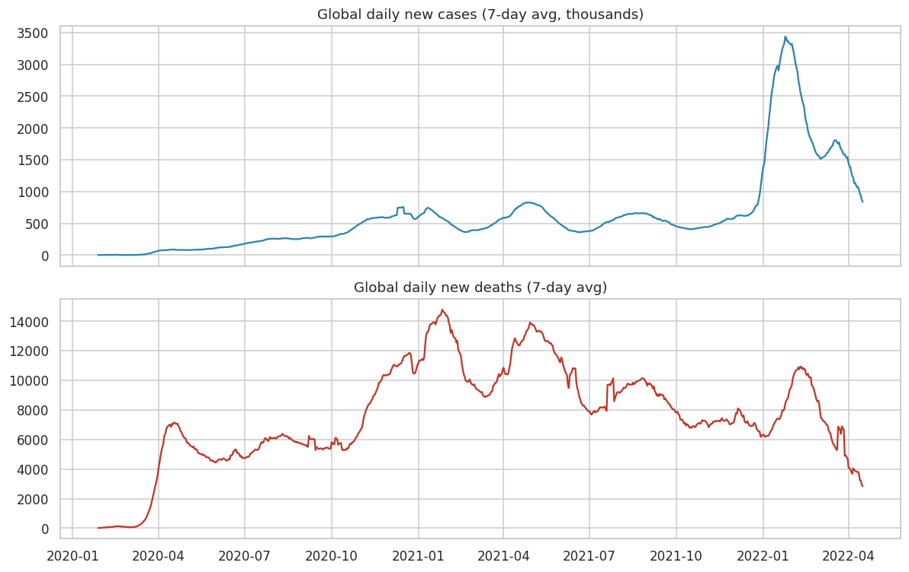
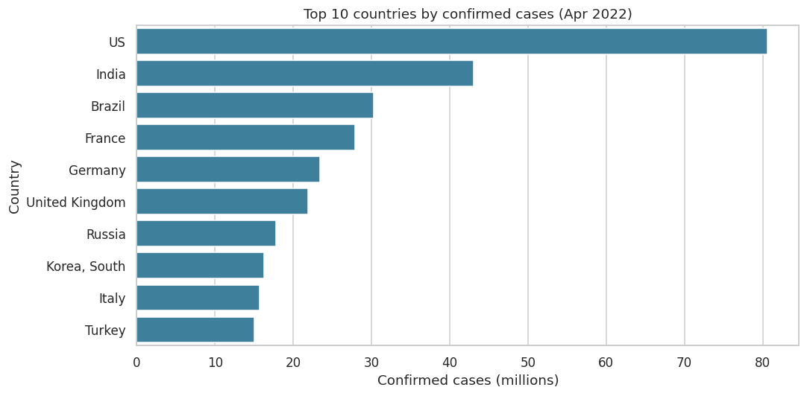
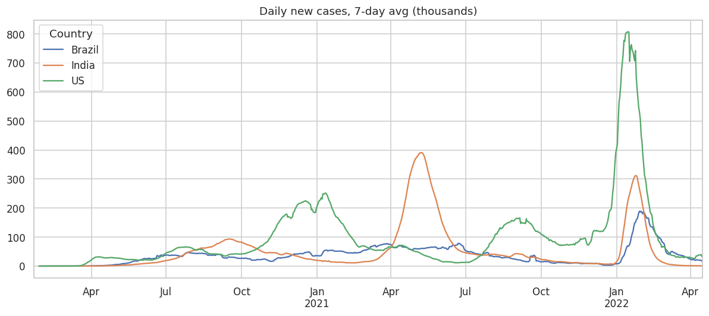
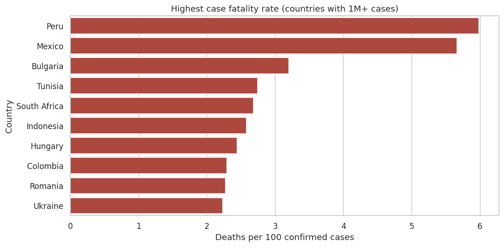
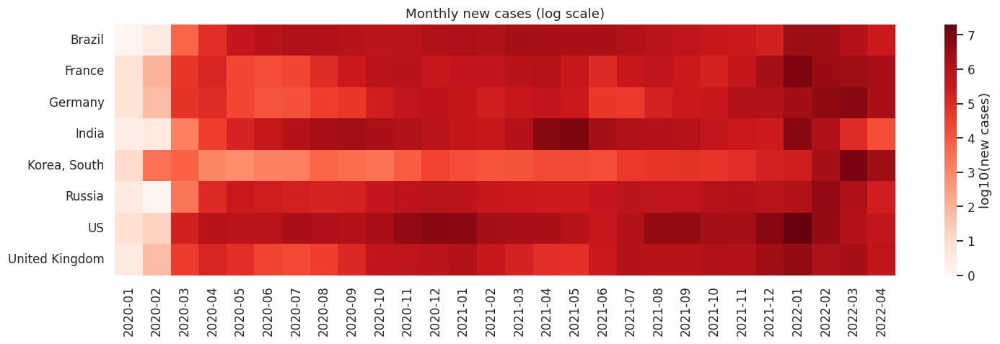

# 🦠 COVID-19 Global Trends — Exploratory Data Analysis

 

An exploratory analysis of COVID-19's spread across **198 countries** from Jan 2020 to Apr 2022: global waves, the hardest-hit countries, fatality rates, and how the waves differed between India, the US and Brazil.

## 📊 Dataset
- **Source:** [datasets/covid-19](https://github.com/datasets/covid-19) (Johns Hopkins CSSE, aggregated by country)
- **Size:** 161,568 rows · 198 countries · daily cumulative `Confirmed`, `Recovered`, `Deaths`

## 🛠️ What I did
1. Checked data quality (no missing values, one row per country per day)
2. Worked out **daily new cases and deaths** from the cumulative counts, clipping negative reporting corrections to zero
3. Smoothed the trends with **7-day rolling averages**
4. Ranked countries by cases and by **case fatality rate (CFR)**
5. Compared wave timing across countries and built a **monthly heatmap**

## 📈 Visuals
| Global waves | Top 10 countries |
|---|---|
|  |  |
| **India vs US vs Brazil** | **Highest CFR (1M+ cases)** |
|  |  |



## 💡 Key insights
- **Cases and deaths peaked at different times.** Deaths peaked in **Jan 2021** (~14.8K/day). Cases peaked in **Jan 2022** (~3.4M/day, Omicron), so there were far more infections but far fewer deaths per case.
- **US (80.6M), India (43.0M), Brazil (30.3M)** had the most cases. India's Delta wave peaked in **May 2021** at ~391K/day.
- **CFR varies widely:** Peru 5.98% and Mexico 5.66%, against a global 1.23%. South Korea had 16.3M cases with a CFR of only 0.13%.

## ▶️ How to run
```bash
pip install pandas matplotlib seaborn jupyter
jupyter notebook covid19_eda.ipynb
```

## 📁 Structure
```
├── data/countries-aggregated.csv
├── images/            # exported charts
├── covid19_eda.ipynb  # full analysis
└── README.md
```

---
👤 **Ansh Rai**, Data Analyst · [LinkedIn](https://www.linkedin.com/in/anshrai-adr) · [GitHub](https://github.com/ANSHRAI21) · [Portfolio](https://a-s-pyratech-solutions.space)
